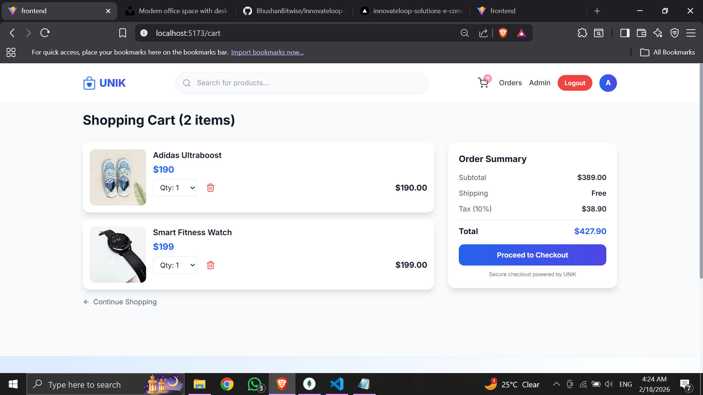
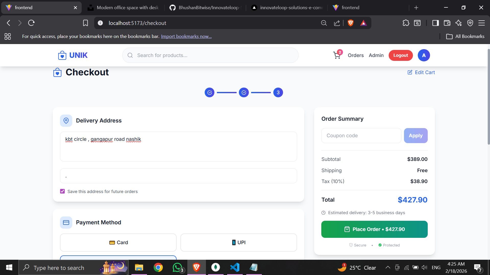
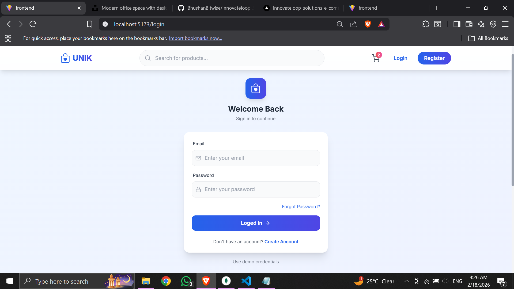

# UNIK – Premium MERN Stack E-Commerce Platform

UNIK is a full-stack production-ready MERN E-Commerce application built with modern UI, secure authentication, role-based admin access, and cloud deployment.

Designed with a premium light-blue aesthetic, smooth animations, and clean architecture.

---

---

##  Features

###  User Features

-  Register / Login (JWT Authentication)
-  Browse Products
-  Search Products
-  Product Badges (New / Sale)
-  Add to Cart
-  Update Cart Quantity
-  Remove from Cart
-  Dummy Checkout
-  Order History
-  Fully Responsive Design
-  Skeleton Loaders
-  Premium Light Blue UI

---

###  Admin Features

-  Add Product
-  Update Product
-  Delete Product
-  Admin Dashboard
-  Role-Based Authorization

---

#  Project Screenshots

##  page 1

---

##  page 2

---

##  page 3

---

##  page 4

---

##  page 5

##  page 6

##  page 7

##  page 8

##  page 9

##  page 10

---

##  Tech Stack

### Frontend
- React (Vite)
- Tailwind CSS
- Context API
- Axios
- React Router DOM
- Framer Motion
- React Icons

### Backend
- Node.js
- Express.js
- MongoDB Atlas
- Mongoose
- JWT Authentication
- bcryptjs
- MVC Architecture
- CORS
- Morgan Logger

##  Security Features

- JWT Secret in Environment Variables
- Password Hashing (bcrypt)
- Role-Based Access Control
- Protected Routes
- CORS Configuration

---

##  UI Highlights

- Light Blue Gradient Premium Theme
- Glassmorphism Cards
- Smooth Hover Animations
- Skeleton Loading States
- Responsive Layout
- Modern Sidebar Navigation

---

##  Future Enhancements

- Payment Gateway Integration
- Wishlist Feature
- Product Reviews
- Dark Mode
- Pagination
- Performance Optimization

---

##  Author

Bhushan Bitwise

